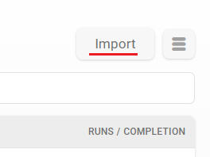
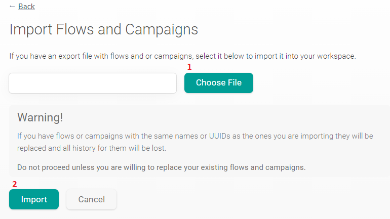

# What is this repository?

> This repository contains files that constitute the Beta Pilot, Nepal, Pode Falar, and U-Matter projects, which are separated into two folders. The 'Workspace' folder includes specifications, configurations, and the foundation that forms the flows of the project's components. The 'AI' folder provides information about the artificial intelligence used, along with their respective datasets.

## All files are in JSON. What is JSON?

> JSON stands for JavaScript Object Notation and it's a lightweight format for storing and transporting data. JSON is "self-describing" and easy to understand.

## What does each file report?

**Workspace folder:**

+ **channels.json**: name of activated channels and their corresponding UUID and creation date;

+ **contacts.json**: UUID of the contact, urns, groups the contact belongs and all their contact fields filled in;

+ **flows.json**: UUID of the flow, its name and flow settings. It can be imported into another Workspace;

+ **globals.json**: global variables and their values;

+ **groups.json**: UUID of al the existing groups and its name, conditional query (only for Smart Groups) and number of users belonging to it;

+ **labels.json**: UUID of the label and its name, along with the number of occurrences;

+ **template.json**: Template Message UUID and its name, the configured language, its namespace, status and the channel in which it was activated.
	
**Artificial Intelligence folder:**

+ Contains the number of trained phrases, text of the phrases, their intentions, language, and date of creation for each AI used in the projects.  

# How to import Workspace files in Dash platform?

Once the Flows files have been downloaded, log in to the [Dash](https://dash.weni.ai/) platform and navigate to the desired Workspace. Then, in the **Flows** tab, click on **Import** located in the right-hand corner:

Select the file you **want to upload**¹ and then click on the **Import** button²:

Please wait a few moments, and soon the files will have been imported.

> Pay attention to the warning above! Check the flows names before importing if you don't want them to be overwritten.

## What will be imported?
+ Flows;
+ Groups;
+ Smart Groups;
+ Contact Fields;
+ Triggers;
+ Campaigns. 

## What will not be imported?
These will need to be configured manually:
+ Filling in **Globals**, if any;
+ **Artificial Intelligences** integrations;
+ Reconnect the **Integrated Channels**;
+ Import the **contact database**.
